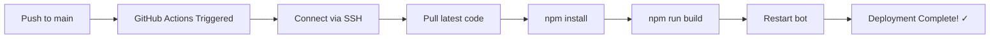

# Quick Start: Deploy to External Server

This guide will help you set up automated deployment in **5 minutes**.

## Prerequisites Checklist

- [ ] An external server with SSH access
- [ ] Node.js and npm installed on the server
- [ ] Your bot code already cloned on the server OR ability to clone it

## Step-by-Step Setup

### 1️⃣ Generate SSH Key (1 minute)

On your local machine:

```bash
ssh-keygen -t ed25519 -C "github-deploy" -f ~/.ssh/github-deploy -N ""
```

This creates:
- `~/.ssh/github-deploy` (private key) ← You'll add this to GitHub
- `~/.ssh/github-deploy.pub` (public key) ← You'll add this to your server

### 2️⃣ Configure Your Server (2 minutes)

Copy your public key to the server:

```bash
# Method 1: Using ssh-copy-id (easiest)
ssh-copy-id -i ~/.ssh/github-deploy.pub user@your-server.com

# Method 2: Manual
cat ~/.ssh/github-deploy.pub
# Then SSH to server and paste into ~/.ssh/authorized_keys
```

On your server, prepare the project:

```bash
# If not already cloned
cd /home/yourusername
git clone https://github.com/xniklas18/webuntis-discord-bot.git
cd webuntis-discord-bot

# Set up environment
cp .env.template .env
nano .env  # Add your credentials

# Initial build
npm install
npm run build

# Optional: Install PM2 for better process management
npm install -g pm2
pm2 start dist/index.js --name webuntis-discord-bot
pm2 save
```

### 3️⃣ Add GitHub Secrets (2 minutes)

1. Go to your GitHub repository
2. Click **Settings** → **Secrets and variables** → **Actions**
3. Click **New repository secret** for each:

| Secret Name | Value | Example |
|-------------|-------|---------|
| `SERVER_HOST` | Your server IP/hostname | `192.168.1.100` |
| `SERVER_USERNAME` | SSH username | `ubuntu` |
| `SSH_PRIVATE_KEY` | Content of `~/.ssh/github-deploy` | Copy entire file |
| `PROJECT_PATH` | Project path on server | `/home/ubuntu/webuntis-discord-bot` |

**To get your private key content:**
```bash
cat ~/.ssh/github-deploy
# Copy everything from -----BEGIN to -----END
```

### 4️⃣ Test Deployment (30 seconds)

Option A: **Automatic** - Push to main branch:
```bash
git push origin main
```

Option B: **Manual** - Trigger from GitHub:
1. Go to **Actions** tab in your repository
2. Select **Deploy to External Server**
3. Click **Run workflow**
4. Watch it deploy! 🚀

## Troubleshooting

### ❌ SSH Connection Failed

```bash
# Test SSH connection manually
ssh -i ~/.ssh/github-deploy user@your-server.com

# If it works manually but not in GitHub Actions, check:
# 1. Did you copy the ENTIRE private key including BEGIN/END lines?
# 2. Is SERVER_HOST correct? (no http://, no trailing slash)
# 3. Is the server port 22? If not, add SERVER_PORT secret
```

### ❌ Permission Denied

```bash
# On your server, check permissions
chmod 700 ~/.ssh
chmod 600 ~/.ssh/authorized_keys

# Verify the public key is in authorized_keys
cat ~/.ssh/authorized_keys | grep github-deploy
```

### ❌ Bot Doesn't Restart

```bash
# Check which process manager you're using
pm2 list                              # If using PM2
sudo systemctl status webuntis-discord-bot  # If using systemd
ps aux | grep "node dist/index.js"    # Check if running

# View logs
pm2 logs webuntis-discord-bot         # PM2 logs
tail -f bot.log                        # nohup logs
sudo journalctl -u webuntis-discord-bot -f  # systemd logs
```

### ❌ Build Failed

```bash
# On your server, test manually
cd /path/to/webuntis-discord-bot
npm install
npm run build

# If it fails, check:
# 1. Node.js version: node --version (should be v16+)
# 2. Disk space: df -h
# 3. Memory: free -h
```

## What Happens During Deployment?



The workflow automatically:
1. ✅ Connects to your server securely
2. ✅ Pulls the latest code changes
3. ✅ Updates dependencies
4. ✅ Builds the TypeScript code
5. ✅ Restarts the bot (PM2/systemd/fallback)
6. ✅ Confirms success

## Next Steps

- [ ] Set up a systemd service for automatic startup on boot
- [ ] Configure PM2 for better process management
- [ ] Add health checks or monitoring
- [ ] Set up a staging environment

## Need More Help?

📚 **Full documentation**: [.github/workflows/README.md](.github/workflows/README.md)

🐛 **Issues?** Check your:
- GitHub Actions logs (Actions tab → latest workflow run)
- Server logs (see commands above)
- Network connectivity (firewall, security groups)

## Pro Tips

💡 **Test locally first**: Always test `npm install && npm run build` on your server before relying on automation

💡 **Use PM2**: It's more reliable than nohup for production: `npm install -g pm2`

💡 **Monitor deployments**: Watch the Actions tab during first few deployments

💡 **Keep secrets secret**: Never commit `.env` files or SSH keys to git!

---

**Time to deploy**: ~5 minutes ⏱️  
**Difficulty**: Easy 🟢  
**Reliability**: High ✅
